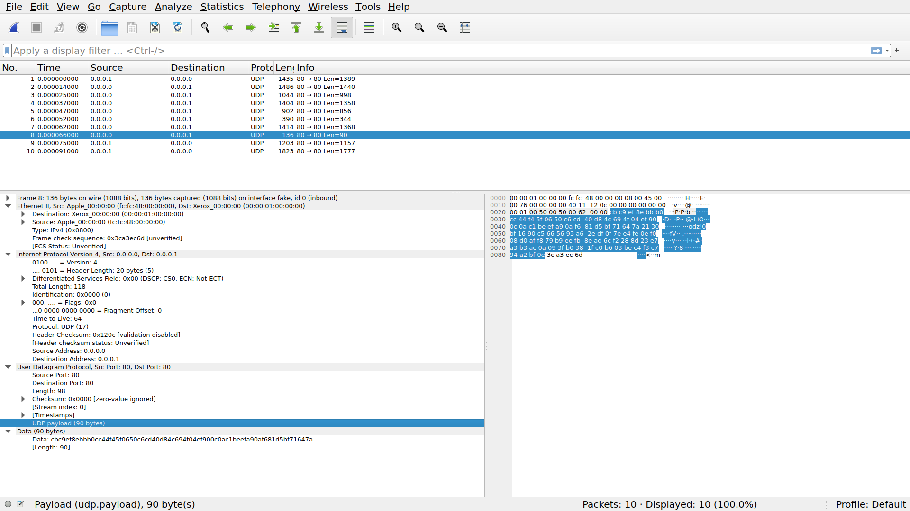

# Network packet C library

Shared library containing network packet structures alongside some
related utilities.

## Testing

For testing purposes this library offers the ability to dump packets into a 
wireshark parseble format.

By default we dump to the `network_dump.hex` file.

To open this dump in `wireshark` use the `import hex dump` import option and
using the following settings :

Packet format regex :
```regex
^(?<dir>[<>])\s(?<time>\d+:\d\d:\d\d.\d+)\s(?<data>[0-9a-fA-F]+)$
```
Direction indication : `<` and `>`

Timestamp format :
```regex
%H:%M:%S.%f
```



## License

This code is licensed under CC BY-NC 4.0, all rights belong to Julia Desmazes. 
